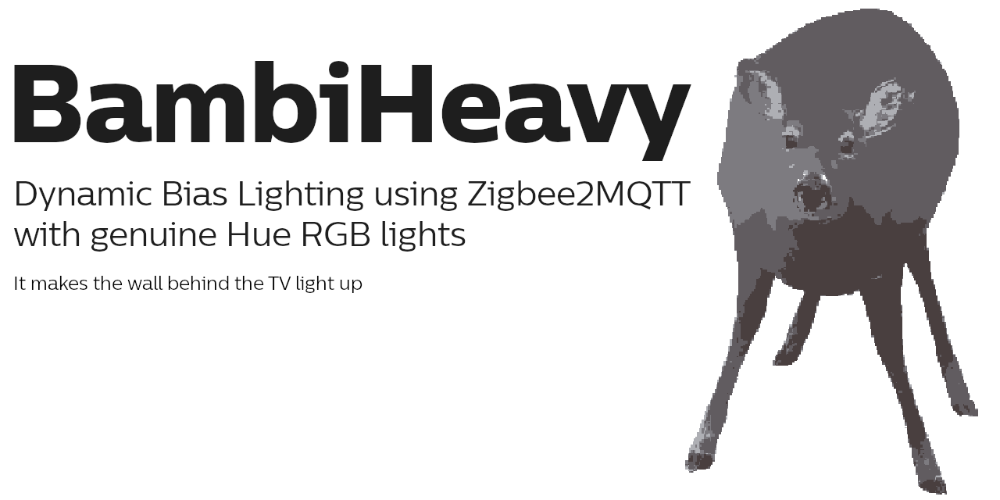

## What is this?

A desktop app sampling the screen, deriving color information from it and sending that to Hue Entertainment capable
Zigbee lights via Zigbee2mqtt.

The general idea of the concept being to "extend" the screen beyond its boundaries through some LED strips, Lamps, etc.

Basically: 
If your screen is red, it makes the wall behind the screen red.

## How is this?

Lots of LLM, a bit of Ghidra.
Occasionally a tiny bit of thought.

> [!IMPORTANT]  
> This is extensively vibecoded software, meaning that there are various places where it lacks intentionality or
> reason. 
> Which, to be fair, is not all that different from the output of the rest of the industry.
>
> In fact, it might be better than that, since I've occasionally yelled at the LLM when it completely lost the
> plot. 
> The industry does not have these guard rails, friction and corrective counterpressures anymore. 
> It just has HR ensuring nice words.
>
> Make of that what you will. 
> Unless what you will is cargo-culting a mirage of "friction" and thinking that just because you're an asshole,
> suddenly software becomes good. 
> That is not how that works.

## Why is this?

1. Ambilight is neat
2. Modern Philips TVs are not all that neat
3. Hue bridge is proprietary (+ cloud) (+ account)
4. Hue sync box behind a general purpose computer feels redundant
5. Bifrost needs some weird networking stuff
6. Hyperion hw setup looks gefrickelt
7. Excess solar => free LLM inference

## What do I need for this?

1. Zigbee2MQTT in some recent version
2. Hue Entertainment capable Hue RGB light running some recent firmware version

## Further questions

An inexhaustive list.

### Why the name?

Legally distinct.

### Why the logo?

AI deep-fried quantized obese deer with extra human seasoning.

### Does this even work?

Maybe. To about 67%

### What about Linux?

Eh. When I feel like it

### What about Mac?

Eh. When you feel like it

### Can you do X for me?

Just download Qwen3.6-27b yourself. It is literally free.

Then click fork. Then stay in that fork. 
Unless you're cool that is.

### You need to do X for me.

I think not.
